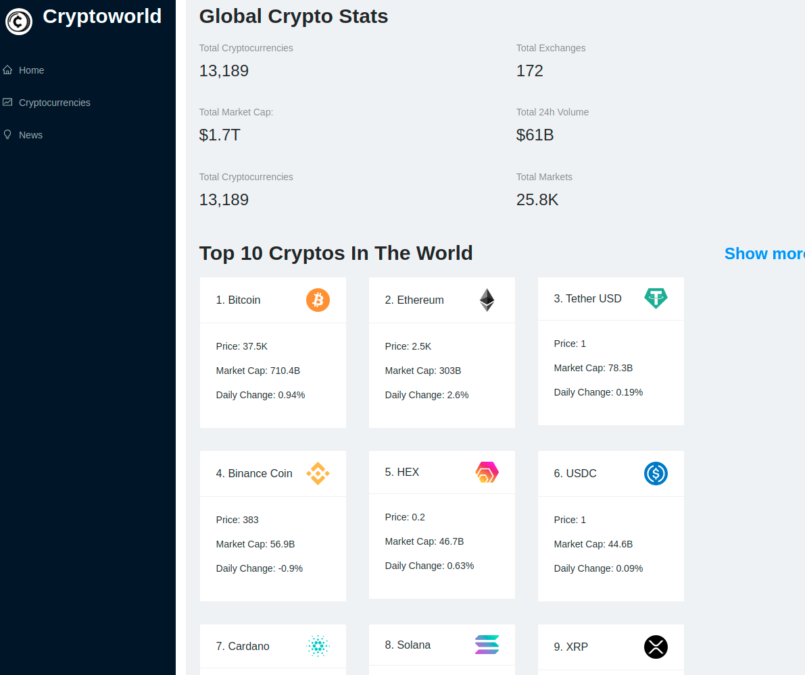

# Cryptocurrency App Clone

## Deployed Site: https://cryptoworld-ab.netlify.app/

## Technology Used

- React
- Millify
- Chartjs
- UUID

## Installation

- Fork/Clone or download zip
- Add .env file and add you api keys
- Run npm install 
- Run npm start

## User Stories

- As a user I would information on the top cryptocurrencies.
- As a user I would Like to be able to see what is happening in the news involving cryptocurrencies
- As a user I would like to be able to search for specific cryptocurrencies and get current information
- As a user I would like to be able to get news on any cryptocurrency I search for

